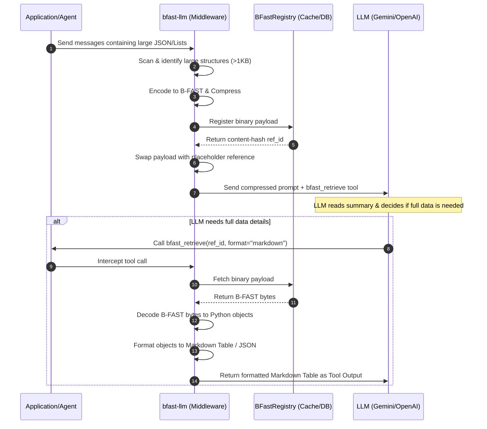
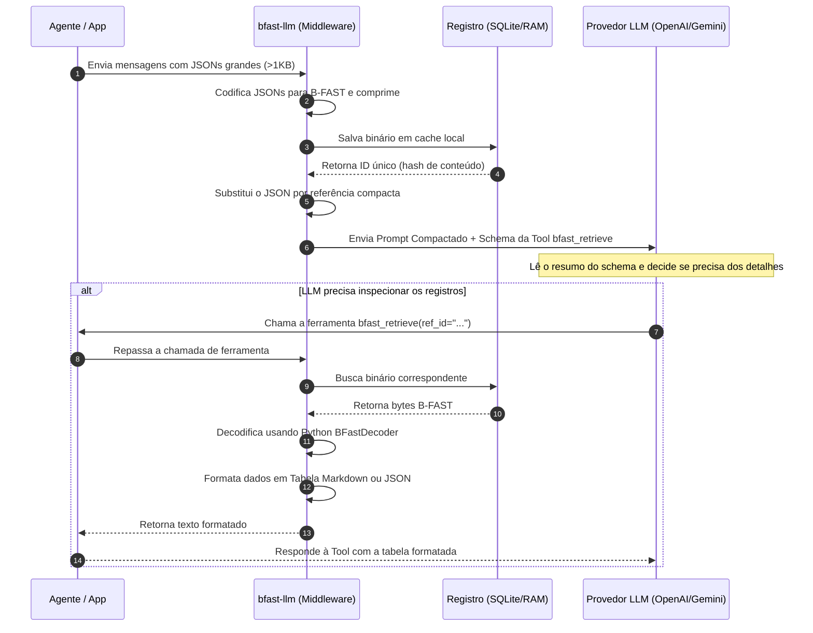

# ⚡ B-FAST LLM (bfast-llm)

*Bilingual documentation: [English](#english) | [Português](#português)*

---

## English

**bfast-llm** is an open-source, local-first context compression layer for Large Language Models (LLMs). It intercepts massive JSON structures, tool outputs, and document contents in your LLM prompts, compresses them using the ultra-high performance [B-FAST](https://github.com/marcelomarkus/b-fast) binary protocol, and swaps them with concise, schema-aware placeholders.

If the LLM decides it needs to read the detailed payload to answer a user's question, it uses the injected `bfast_retrieve` tool. The middleware intercepts this tool call, decodes the binary block locally using the high-performance B-FAST decoder, and formats it on the fly (into Markdown tables, JSON, CSV, or YAML) to present back to the LLM.


### 📐 Systems Architecture & Flow



### 🚀 Key Features

*   **Content-Compressed Retrieval (CCR):** Reduces prompt token usage by **60% to 95%** transparently, preserving reasoning capabilities.
*   **Pure Python B-FAST Decoder:** A full-featured Python decoder for the B-FAST protocol, supporting all native B-FAST tags (Integers, Float64, Strings, Dates, UUIDs, Decimals, Lists, Objects, and NumPy Arrays).
*   **High-Performance Decoder:** Built-in decoder handles compressed B-FAST binary structures natively.
*   **Smart Summarizer (Schema-Aware):** Inspects payloads to extract high-level structure and schemas (e.g. `List of 25 objects. Schema: {id: int, name: str}`) so the LLM knows what is inside without reading the raw data.
*   **Deduplication Registry:** Generates content-hash-based IDs (`SHA-256`) to automatically deduplicate identical payloads in the conversation history.
*   **Flexible Caching:** Supports transient **In-Memory** caching or persistent **SQLite** databases.
*   **Rich Formatter:** Renders binary B-FAST data to the LLM as Markdown tables, raw JSON, YAML, or CSV on demand.

### 📦 Installation

Install `bfast-llm` directly from PyPI. This will automatically pull and install the core `bfast-py` dependency as well:

```bash
pip install bfast-llm
```

### 🔌 Plug & Play Proxy Mode (Zero Code Changes)

If you don't want to change any code in your application (or if you are using existing developer tools like Aider, Cursor, LangChain, or custom agents), you can run `bfast-llm` as a local HTTP proxy server.

1. **Start the Proxy Server:**
   ```bash
   bfast-llm-proxy
   ```
   *This starts a local server on `http://localhost:8787` pointing to OpenAI's API by default.*

2. **Configure Upstream & Port (Optional):**
   ```bash
   export UPSTREAM_API_BASE=https://api.openai.com/v1
   export PROXY_PORT=8787
   export THRESHOLD_BYTES=1024
   bfast-llm-proxy
   ```

3. **Redirect your Agent to the Proxy:**
   Simply set the `OPENAI_BASE_URL` environment variable:
   ```bash
   export OPENAI_BASE_URL=http://localhost:8787/v1
   ```
   *Now, any script, LangChain agent, or developer assistant running in this terminal will have its prompt contexts compressed automatically and transparently!*

### 🛠️ Usage Example (One-Liner Integration)

`bfast-llm` provides a simple drop-in wrapper for the OpenAI client. It automatically handles prompt compression, registers the retrieval tool, and resolves retrieval requests transparently.

```python
import json
from openai import OpenAI
from bfast_llm import bfast_tune

# 1. Initialize client and apply patch
client = bfast_tune(OpenAI(api_key="your-api-key"), threshold_bytes=1024)

# 2. Setup messages containing a large payload
large_query_output = [
    {"id": i, "name": f"User {i}", "role": "Engineer", "active": True}
    for i in range(100)
]

messages = [
    {"role": "system", "content": "You are a helpful data analyst."},
    {"role": "user", "content": "Analyze the query results."},
    {"role": "tool", "content": json.dumps(large_query_output), "tool_call_id": "call_db_1"}
]

# 3. Call the API normally! Prompt compression and retrieval loop are handled transparently!
response = client.chat.completions.create(
    model="gpt-4o",
    messages=messages
)

print(response.choices[0].message.content)
```

*(Note: Advanced users can still access the underlying raw middleware `BFastLLM` and helper functions like `wrap_completion` directly.)*

---

## Português

O **bfast-llm** é uma camada de compressão de contexto local-first para Modelos de Linguagem de Grande Porte (LLMs). Ele intercepta grandes estruturas JSON, saídas de ferramentas (tool outputs) e logs nos prompts do LLM, comprime os dados utilizando o protocolo binário de ultra-alta performance [B-FAST](https://github.com/marcelomarkus/b-fast) e os substitui por referências estruturadas conscientes do schema.

Se o LLM decidir que precisa ler os dados detalhados para responder a uma pergunta do usuário, ele aciona a ferramenta integrada `bfast_retrieve`. O middleware intercepta essa chamada, decodifica o bloco binário localmente utilizando o decodificador de alta performance do B-FAST e formata os dados dinamicamente (em tabelas Markdown, JSON, CSV ou YAML) para entregar de volta ao LLM.


### 📐 Arquitetura e Fluxo



### 🚀 Funcionalidades Principais

*   **Content-Compressed Retrieval (CCR):** Reduz o consumo de tokens em prompts de **60% a 95%** de forma transparente, mantendo a capacidade de raciocínio do modelo.
*   **Decodificador B-FAST Nativo em Python:** Decodificador completo desenvolvido em Python puro, eliminando a necessidade de dependências compiladas no cliente que consome os dados. Suporta todos os tipos B-FAST (Integers, Float64, Strings, Dates, UUIDs, Decimals, Lists, Objects e NumPy Arrays).
*   **Decodificador de Alta Performance:** Decodificador integrado que processa estruturas binárias compactadas nativamente.
*   **Resumos Inteligentes de Schema:** Analisa listas profundas de objetos e extrai metadados estruturais (ex: `List of 25 objects. Schema: {id: int, name: str, active: bool}`) para que o LLM saiba exatamente o que está na referência sem consumir tokens de dados.
*   **Deduplicação de Cache por Hash:** Gera chaves baseadas em `SHA-256` do conteúdo. Dados idênticos compartilhados no histórico do prompt usam a mesma referência de cache automaticamente.
*   **Armazenamento Flexível:** Suporta persistência transient em **Memória (RAM)** ou banco de dados relacional leve **SQLite** para históricos persistentes de agentes.
*   **Visualização Customizada:** Formata os dados binários para o LLM em tabelas Markdown estruturadas, JSON identado, YAML limpo ou CSV.

### 📦 Instalação

Instale o `bfast-llm` diretamente do PyPI. O instalador gerenciará automaticamente o download e configuração de todas as dependências necessárias, incluindo o core `bfast-py`:

```bash
pip install bfast-llm
```

### 🔌 Modo Proxy Plug & Play (Zero Alterações de Código)

Se você não quer alterar nenhuma linha de código da sua aplicação (ou se estiver utilizando ferramentas prontas como Aider, Cursor, LangChain ou agentes pré-existentes), você pode rodar o `bfast-llm` como um proxy HTTP local.

1. **Inicie o Servidor Proxy:**
   ```bash
   bfast-llm-proxy
   ```
   *Isso inicia o servidor local em `http://localhost:8787` direcionado à API da OpenAI por padrão.*

2. **Configure o Upstream e a Porta (Opcional):**
   ```bash
   export UPSTREAM_API_BASE=https://api.openai.com/v1
   export PROXY_PORT=8787
   export THRESHOLD_BYTES=1024
   bfast-llm-proxy
   ```

3. **Direcione seu Agente para o Proxy:**
   Basta definir a variável de ambiente `OPENAI_BASE_URL`:
   ```bash
   export OPENAI_BASE_URL=http://localhost:8787/v1
   ```
   *A partir de agora, qualquer script, framework ou assistente rodando nesse terminal terá seus contextos de prompt comprimidos automaticamente de forma 100% transparente!*

### 🛠️ Como Usar (Integração em Uma Linha)

O `bfast-llm` fornece um wrapper extremamente simples para o cliente da OpenAI. Ele gerencia a compressão de prompts, registra a ferramenta de recuperação e resolve as chamadas de ferramentas de forma 100% transparente.

```python
import json
from openai import OpenAI
from bfast_llm import bfast_tune

# 1. Inicializar o cliente da OpenAI e aplicar o patch
client = bfast_tune(OpenAI(api_key="sua-chave-api"), threshold_bytes=1024)

# 2. Configurar os dados simulando retorno do banco de dados
dados_banco = [
    {"id": i, "name": f"Usuario {i}", "role": "Engenheiro", "active": i % 2 == 0}
    for i in range(150)
]

messages = [
    {"role": "system", "content": "Você é um assistente de análise de dados."},
    {"role": "user", "content": "Gere um relatório sobre os usuários da consulta anterior."},
    {"role": "tool", "content": json.dumps(dados_banco), "tool_call_id": "call_db_query_1"}
]

# 3. Chame a API normalmente! A compressão e o loop de recuperação são tratados de forma transparente!
response = client.chat.completions.create(
    model="gpt-4o",
    messages=messages
)

print(response.choices[0].message.content)
```

*(Nota: Usuários avançados ainda podem acessar diretamente a classe middleware `BFastLLM` ou a função decoradora `wrap_completion`.)*

---

## 📄 License / Licença
Distributed under the MIT License. Veja `LICENSE` para mais detalhes.
