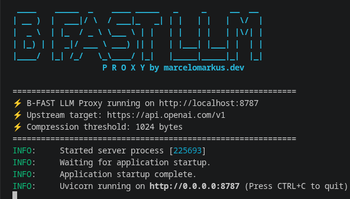

# ⚡ B-FAST LLM (bfast-llm)

Bem-vindo à documentação do **bfast-llm**.

O **bfast-llm** é uma camada de compressão de contexto local-first de código aberto para Modelos de Linguagem de Grande Porte (LLMs). Ele intercepta estruturas massivas, saídas de ferramentas e conteúdos de documentos em seus prompts de LLM, compactando-os utilizando o protocolo binário de altíssimo desempenho [B-FAST](https://github.com/marcelomarkus/b-fast)

Se o LLM decidir que precisa ler a carga detalhada para responder à pergunta de um usuário, ele usa o bfast-llm. O middleware intercepta essa chamada, decodifica o bloco binário localmente usando o decodificador B-FAST de alta performance e devolve ao LLM.

---

## 🚀 Principais Recursos

*   **Content-Compressed Retrieval (CCR):** Reduz drasticamente o consumo de tokens em prompts de forma transparente, mantendo a capacidade de raciocínio do modelo.
*   **Decodificador B-FAST de Alta Performance:** Processamento veloz e eficiente de estruturas binárias compactadas nativamente.
*   **Resumos Inteligentes de Estrutura:** Permite ao LLM identificar a estrutura geral e o esquema dos dados sem precisar ler a carga de dados bruta.
*   **Registro e Deduplicação:** Evita o processamento repetitivo de dados idênticos no histórico da conversa por meio de identificação única.
*   **Armazenamento Flexível:** Suporta persistência otimizada dos dados em memória ou em disco.
